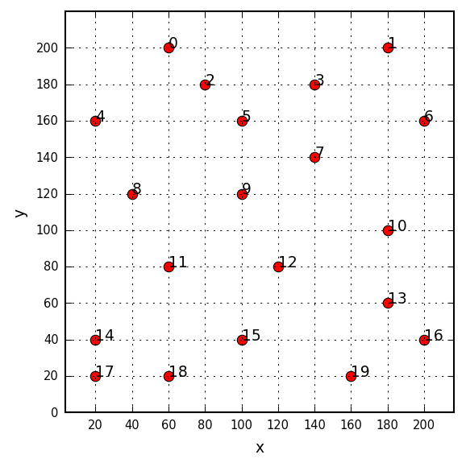

# Examples

## Summary

* The Traveling salesman problem (small test)

## The Traveling salesman problem (small test)

A common transportation problem is to find the shortest path when visiting a number of neighbouring
places or cities in a geographical region. This is commonly known as the _ravelling salesman
problem_ or TSP for short.

This is indeed a challenging problem and is known to be [NP-hard](https://en.wikipedia.org/wiki/NP-hardness).
A genetic algorithm is a suitable approach to solve this problem.

Using a `tlga`, for the cities displayed in the figure below, find the shortest path for a traveller
who wants to visit all cities and later return to the initial one; any departure city is allowed.

Source code: <a href="travelingsalesman01.py">travelingsalesman01.py</a>

<div id="container">
<p></p>
</div>

### Final solution

The final solution looks like:

<div id="container">
<p></p>
</div>

### Source code

The `tlga` script is:

```python
# initialise random numbers generator
Seed(1234) # use a fixed seed, so every time we run this code we will get the same results

# location / coordinates of cities
L = array([[ 60, 200],
           [180, 200],
           [ 80, 180],
           [140, 180],
           [ 20, 160],
           [100, 160],
           [200, 160],
           [140, 140],
           [ 40, 120],
           [100, 120],
           [180, 100],
           [ 60,  80],
           [120,  80],
           [180,  60],
           [ 20,  40],
           [100,  40],
           [200,  40],
           [ 20,  20],
           [ 60,  20],
           [160,  20]], dtype=float)

# 'display' function
def xFcn(c): return '-'.join(['%d' % v for v in c])

# objective function
def oFcn(c):
    dist = 0.0
    for i in range(1, len(c)):
        a, b = c[i-1], c[i]
        dist += sqrt((L[b][0]-L[a][0])**2.0 + (L[b][1]-L[a][1])**2.0)
    a, b = c[-1], c[0]
    dist += sqrt((L[b][0]-L[a][0])**2.0 + (L[b][1]-L[a][1])**2.0)
    return dist

# input data
ninds  = 50    # number of individuals: population size
ngen   = 100   # number of generations
pc     = 0.8   # probability of crossover
pm     = 0.01  # probability of mutation
elite  = True  # use elitism
sus    = False # stochastic universal sampling
rnk    = False # ranking
rnkSP  = 1.5   # selective pressure for ranking

# population
C = []
for i in range(ninds):
    I = range(len(L)) # one individual
    Shuffle(I)
    C.append(I)
C = array(C, dtype=int)

# objective values
Y = array([oFcn(c) for c in C]) # objective values

# print initial population
print '\ninitial population:'
PrintPop(C, Y, xFcn)

# define crossover and mutation functions
def cxFcn(A, B): return OrdCrossover(A, B, pc)
def muFcn(c):    return OrdMutation(c, pm)

# run GA
C, Y, OV = Evolve(C, xFcn, oFcn, cxFcn, muFcn, ngen, elite, sus, rnk, rnkSP)
X = [xFcn(c) for c in C]

# print final population
print '\nfinal population:'
PrintPop(C, Y, xFcn)

# print best individual
print '\nbest =', X[0], ' OV =', Y[0]
```

### Output

```
inal population:
=========================================================
                                                x       y
---------------------------------------------------------
0-4-8-11-14-17-18-15-12-19-13-16-10-6-1-3-7-9-5-2 894.363
12-19-13-16-10-6-1-3-7-5-9-2-0-4-8-11-14-17-18-15 929.324
12-19-13-16-10-6-1-3-7-5-9-2-0-4-8-11-14-17-18-15 929.324
15-12-19-13-16-10-6-1-3-7-5-9-2-0-4-8-11-14-17-18 929.324
18-15-12-19-13-16-10-6-1-3-7-5-9-2-0-4-8-11-14-17 929.324
18-15-12-19-13-16-10-6-1-3-7-5-9-2-0-4-8-11-14-17 929.324
15-12-19-13-16-10-6-1-3-5-9-7-2-0-4-8-11-14-17-18 942.911
18-15-12-19-13-16-10-6-1-3-7-9-2-5-0-4-8-11-14-17 945.893
18-15-12-19-13-16-10-6-1-3-7-5-9-2-0-4-8-11-17-14 949.588
15-12-13-16-10-6-1-3-5-7-9-2-0-4-8-11-14-17-18-19  1003.7
14-15-12-19-13-16-10-6-1-3-7-5-9-2-0-4-8-11-17-18 1004.87
19-15-12-13-16-10-6-1-7-3-5-9-2-0-4-8-11-14-17-18 1021.65
17-18-15-12-19-13-16-10-1-3-6-7-9-2-5-0-4-8-11-14 1024.42
18-15-12-19-13-16-10-6-1-3-7-2-5-0-9-4-8-11-14-17 1032.35
15-12-19-13-16-10-6-1-2-3-7-5-9-0-4-8-11-14-17-18  1044.5
15-12-19-13-16-10-6-1-5-3-7-2-9-0-4-8-11-14-17-18 1067.32
18-15-12-19-13-16-10-6-1-3-7-9-2-5-0-8-11-4-14-17 1079.94
18-15-2-0-4-8-12-19-13-16-10-6-1-3-7-9-5-11-14-17 1096.94
15-12-19-13-16-10-3-6-5-1-7-9-2-0-4-8-11-14-17-18 1110.88
18-15-12-19-13-16-10-6-1-3-7-2-9-5-0-8-11-4-14-17 1119.04
15-12-19-13-16-10-6-1-3-7-9-2-4-8-11-5-0-14-17-18 1122.08
15-12-19-13-16-10-6-1-3-7-9-2-4-8-11-5-0-14-17-18 1122.08
18-15-12-3-19-13-16-10-6-1-7-9-2-5-0-4-8-11-14-17  1124.4
18-15-12-3-19-13-16-10-6-1-7-9-2-5-0-4-8-11-14-17  1124.4
12-19-13-3-9-16-10-6-1-7-5-2-0-4-8-11-14-17-18-15 1140.13
18-15-12-19-13-16-10-6-3-7-8-9-1-5-2-0-4-11-14-17    1148
15-12-19-13-16-5-10-6-1-3-7-9-8-2-0-4-11-14-17-18 1151.15
14-15-12-19-13-16-10-6-1-3-7-2-5-0-9-4-11-8-17-18 1182.49
15-12-19-13-16-1-10-3-6-5-7-9-2-0-4-8-11-14-17-18 1192.05
15-12-19-8-13-16-10-6-1-3-7-5-9-2-0-4-11-14-17-18 1193.12
14-12-15-11-17-19-13-16-10-6-1-7-9-5-3-2-0-4-8-18 1203.15
15-12-13-16-10-6-1-3-7-19-2-5-0-9-4-8-11-14-17-18  1207.2
15-12-19-0-13-16-10-6-1-3-7-5-9-2-4-8-11-14-17-18  1253.3
12-19-13-17-16-10-6-1-7-3-5-9-2-0-4-8-11-14-18-15 1259.18
19-15-12-13-16-10-6-1-3-7-9-2-5-0-17-4-8-11-14-18 1263.37
19-15-12-13-16-10-6-1-3-7-9-2-5-0-17-4-8-11-14-18 1263.37
12-19-13-16-10-6-0-1-3-7-9-2-4-8-11-5-14-17-18-15 1265.69
15-12-19-13-16-17-10-6-1-3-7-2-9-5-0-4-8-11-14-18 1266.47
12-8-19-13-16-10-1-3-6-2-7-9-5-0-4-11-14-17-18-15 1276.94
2-0-15-12-19-13-16-10-6-1-5-7-9-8-4-11-14-17-18-3 1282.76
15-13-16-10-6-1-12-19-0-3-7-5-9-2-4-8-11-17-14-18 1298.82
12-19-13-5-2-16-10-6-1-3-7-9-0-4-8-14-11-18-17-15 1315.17
12-19-13-3-16-10-6-1-7-8-11-5-9-2-0-4-14-17-18-15 1332.65
12-19-4-11-13-16-10-6-1-3-7-9-5-8-2-0-14-17-18-15 1337.01
15-12-19-13-16-14-10-5-1-3-6-7-9-2-0-4-8-11-17-18 1340.47
19-15-12-13-16-4-10-6-1-3-7-2-9-5-0-8-11-14-17-18 1355.08
15-12-13-3-7-11-5-16-10-6-1-9-2-0-4-8-14-17-18-19 1402.98
18-15-12-19-13-16-14-10-6-3-7-8-9-1-5-2-0-4-11-17 1431.18
12-19-13-3-9-16-10-6-1-7-5-2-0-14-18-4-8-11-17-15  1432.1
14-1-15-12-3-19-13-16-10-6-7-5-9-2-0-4-8-11-17-18 1454.94
=========================================================

best = 0-4-8-11-14-17-18-15-12-19-13-16-10-6-1-3-7-9-5-2  OV = 894.362907048
```
